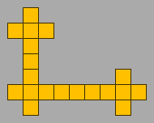
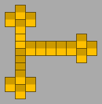
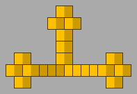
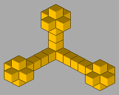

# isometry
Draw an isometric image consisting of building blocks (small cubes) according to instructions in a text file.
Requires the [Pillow](https://python-pillow.org) module.

Table of contents:
* [3D coordinates](#3d-coordinates)
* [Command line arguments](#command-line-arguments)
* [Input file](#input-file)
* [Colour numbers](#colour-numbers)
* [Other files](#other-files)

## 3D coordinates
Two types of 3D coordinates are supported.

### Type 1
* X+ = right
* Y+ = towards viewer
* Z+ = up
* uses building blocks `block-t1-*.png`

Examples with zero/nonzero depth:




### Type 2
* X+ = right and towards viewer
* Y+ = left and towards viewer
* Z+ = up
* uses building blocks `block-t2-*.png`

Examples with zero/nonzero depth:




## Command line arguments
*inputFile outputFile 3dCoordinateType blockWidth blockDepth blockHeight axesToRotate axesToMirror*
* *inputFile*: file to read (describes the 3D object; see "input file" below)
* *outputFile*: image file to write (PNG, RGB without alpha)
* *3dCoordinateType*: 1 or 2 (see "3D coordinates" above)
* *blockWidth, blockDepth, blockHeight*: size of building blocks (small cubes; see "notes" below)
* *axesToRotate*:
  * a string consisting of the characters `X`, `Y`, `Z`; zero to three of each
  * for each character, the object will be rotated 90 degrees counterclockwise around that axis
  * the order of the characters does not matter
  * optional (default is no rotation)
  * case insensitive
* *axesToMirror*:
  * a string consisting of the characters `X`, `Y` and `Z`; zero or one of each
  * for each character, the object will be mirrored along that axis
  * optional (default is no mirroring)
  * case insensitive

Notes:
* All arguments except *axesToRotate* and *axesToMirror* are required.
* A combination of *3dCoordinateType*, *blockWidth*, *blockDepth* and *blockHeight* requires the corresponding building block file (see "other files" below).

## Input file
* Describes the 3D object to draw.
* Encoding: ASCII.
* Case insensitive.
* On each line, leading whitespace is ignored.
* Lines that are ignored:
  * empty lines
  * comments (lines that start with `#`)
* "Setting" lines:
  * All of these settings must be specified somewhere in the file, each on their own line.
  * Object width in blocks: `W` immediately followed by an integer 1&ndash;256.
  * Object depth in blocks: `D` immediately followed by an integer 1&ndash;256.
  * Object height in blocks: `H` immediately followed by an integer 1&ndash;256.
  * Background colour: `B` immediately followed by 6 hexadecimal digits (`RRGGBB`, `000000`&ndash;`ffffff`).
* "Block" lines:
  * Each line describes a slice of *objectWidth*&times;1&times;1 blocks of the object from left to right.
  * Syntax of each line: a pipe (`|`) followed by up to *objectWidth* spaces or digits, plus optionally newline.
  * A space or a `0` denotes "no block" and `1`&ndash;`9` denotes a block of that colour (see "colour numbers" below).
  * If there are less than *objectWidth* spaces or digits, the rest of the line is implicitly padded with spaces or zeroes.
  * The number of lines must be *objectHeight*&times;*objectDepth*.
  * Order of lines: first rear to front, then bottom to top. That is, each group of *objectDepth* lines represents a horizontal layer.

An example (a single black block on red background):
```
W1
D1
H1
Bff0000
|1
```

## Colour numbers
* 0: none (transparent)
* 1: black
* 2: blue
* 3: yellow
* 4: white
* 5&ndash;9: currently unsupported

## Other files
* `block-tT-wW-dD-hH.png`: the building blocks (small cubes); `T`/`W`/`H`/`D` are 3D coordinate type, width, height and depth.
