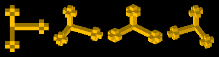
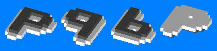

# isometry
Programs that read a 3D image consisting of small cubes from a "voxel file" (see "voxel files" below) and output a rendered PNG image or an OpenSCAD file.

Table of contents:
* [3D coordinates](#3d-coordinates)
* [voxel2png.py](#voxel2pngpy)
* [voxel2scad.py](#voxel2scadpy)
* [Voxel files](#voxel-files)
* [Colour numbers](#colour-numbers)
* [Other files](#other-files)

## 3D coordinates
* width: X+ = right and possibly towards viewer
* depth: Y+ = towards viewer and possibly left
* height: Z+ = up and possibly towards viewer

Examples without X rotation and increasing Z rotation from `voxel2png.py`:


Examples with 45-degree X rotation and increasing Z rotation from `voxel2png.py`:



Examples of mirroring (none, along X axis, along Y axis, along Z axis) from `voxel2png.py`:



## voxel2png.py
Renders a voxel file as a PNG image file without perspective. Requires the [Pillow](https://python-pillow.org) module.

Command line arguments: *inputFile outputFile xRotation yRotation zRotation axesToMirror*
* *inputFile*: voxel file to read (see "voxel files" below)
* *outputFile*: image file to write (PNG, RGB without alpha)
* *xRotation*, *yRotation*, *zRotation*: how much to rotate the object clockwise around each axis:
  * unit: 22.5 degrees (1/16 of a full turn)
  * an integer between 0 and 15
  * for *xRotation*, only even numbers are supported
  * for *yRotation*, only multiples of 4 are supported
* *axesToMirror*:
  * a string consisting of the characters `X`, `Y` and `Z`; zero or one of each
  * for each character, the object will be mirrored along that axis
  * the order of the characters does not matter
  * optional (default is no mirroring)
  * case insensitive

Note: all arguments except *axesToMirror* are required.

## voxel2scad.py
Converts a voxel file into an OpenSCAD file (`.scad`). Does not require Pillow.

Command line argument: voxel file to read (see "voxel files" below)

Prints the output data to `stdout` (screen).

## Voxel files
* Describes a 3D object using small cubes.
* This format was developed by me; it's not used anywhere else as far as I know.
* Encoding: UTF-8.
* File extension: `.txt`
* Case insensitive.
* On each line, leading whitespace is ignored.
* Lines that are ignored:
  * empty lines
  * comments (lines that start with `#`)
* "Setting" lines:
  * All of these settings must be specified somewhere in the file, each on their own line.
  * Object width in blocks: `W` immediately followed by an integer 1&ndash;256.
  * Object depth in blocks: `D` immediately followed by an integer 1&ndash;256.
  * Object height in blocks: `H` immediately followed by an integer 1&ndash;256.
  * Background colour: `B` immediately followed by 6 hexadecimal digits (`RRGGBB`, `000000`&ndash;`ffffff`). Not used by `voxel2scad.py`.
* "Block" lines:
  * Each line describes a slice of *objectWidth*&times;1&times;1 blocks of the object from left to right.
  * Syntax of each line: a pipe (`|`) followed by up to *objectWidth* spaces or digits, plus optionally newline.
  * A space or a `0` denotes "no block" and `1`&ndash;`9` denotes a block of that colour (see "colour numbers" below).
  * If there are less than *objectWidth* spaces or digits, the rest of the line is implicitly padded with spaces or zeroes.
  * The number of lines must be *objectHeight*&times;*objectDepth*.
  * Order of lines: first rear to front, then bottom to top. That is, each group of *objectDepth* lines represents a horizontal layer.

An example (a single black block on red background):
```
W1
D1
H1
Bff0000
|1
```

There are more examples under `test-in/`

## Colour numbers
Colour indexes used in voxel files:
* 0: none (transparent)
* 1: black
* 2: red
* 3: orange
* 4: yellow
* 5: green
* 6: cyan
* 7: blue
* 8: magenta
* 9: white

## Other files
`blocks-small.png` contains the building blocks (small cubes); it's read programmatically:


