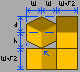

# isometry
Draw an isometric image consisting of building blocks (small cubes) according to instructions in a text file.
Requires the [Pillow](https://python-pillow.org) module.

Table of contents:
* [3D coordinates](#3d-coordinates)
* [Command line arguments](#command-line-arguments)
* [Input file](#input-file)
* [Colour numbers](#colour-numbers)
* [Other files](#other-files)

## 3D coordinates
* width: X+ = right and towards viewer
* depth: Y+ = left and towards viewer
* height: Z+ = up

Examples with zero depth:


Examples with nonzero depth:


## Command line arguments
*inputFile outputFile blockWidth1 blockWidth2 blockDepth1 blockDepth2 blockHeight axesToRotate axesToMirror*
* *inputFile*: file to read (describes the 3D object; see "input file" below)
* *outputFile*: image file to write (PNG, RGB without alpha)
* *blockWidth1, blockWidth2, blockDepth1, blockDepth2, blockHeight*: size of building blocks (small cubes; see "notes" below)
* *axesToRotate*:
  * a string consisting of the characters `X`, `Y`, `Z`; zero to three of each
  * for each character, the object will be rotated 90 degrees counterclockwise around that axis
  * the order of the characters does not matter
  * optional (default is no rotation)
  * case insensitive
* *axesToMirror*:
  * a string consisting of the characters `X`, `Y` and `Z`; zero or one of each
  * for each character, the object will be mirrored along that axis
  * optional (default is no mirroring)
  * case insensitive

Notes:
* All arguments except *axesToRotate* and *axesToMirror* are required.
* Only these combinations of *blockWidth1*, *blockWidth2*, *blockDepth* and *blockHeight* are supported (see also "other files" below):
  * 21 0 0 0 21
  * 21 0 16 0 16
  * 19 8 0 0 21
  * 15 15 0 0 21
  * 15 15 8 8 16

## Input file
* Describes the 3D object to draw.
* Encoding: ASCII.
* Case insensitive.
* On each line, leading whitespace is ignored.
* Lines that are ignored:
  * empty lines
  * comments (lines that start with `#`)
* "Setting" lines:
  * All of these settings must be specified somewhere in the file, each on their own line.
  * Object width in blocks: `W` immediately followed by an integer 1&ndash;256.
  * Object depth in blocks: `D` immediately followed by an integer 1&ndash;256.
  * Object height in blocks: `H` immediately followed by an integer 1&ndash;256.
  * Background colour: `B` immediately followed by 6 hexadecimal digits (`RRGGBB`, `000000`&ndash;`ffffff`).
* "Block" lines:
  * Each line describes a slice of *objectWidth*&times;1&times;1 blocks of the object from left to right.
  * Syntax of each line: a pipe (`|`) followed by up to *objectWidth* spaces or digits, plus optionally newline.
  * A space or a `0` denotes "no block" and `1`&ndash;`9` denotes a block of that colour (see "colour numbers" below).
  * If there are less than *objectWidth* spaces or digits, the rest of the line is implicitly padded with spaces or zeroes.
  * The number of lines must be *objectHeight*&times;*objectDepth*.
  * Order of lines: first rear to front, then bottom to top. That is, each group of *objectDepth* lines represents a horizontal layer.

An example (a single black block on red background):
```
W1
D1
H1
Bff0000
|1
```

## Colour numbers
* 0: none (transparent)
* 1: black
* 2: blue
* 3: red
* 4: yellow
* 5: white
* 6&ndash;9: currently unsupported

## Other files
`blocks.png` contains the building blocks (small cubes); it's read programmatically:


How the width, depth and height of a block are determined:


